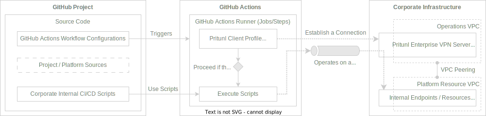

# Pritunl Client GitHub Action

Establish a [Pritunl VPN](https://pritunl.com/) connection using [Pritunl Client](https://client.pritunl.com/) supporting [OpenVPN](https://openvpn.net/) (ovpn) and [WireGuard](https://www.wireguard.com/) (wg) modes on [GitHub Actions](https://github.com/features/actions).

This utility helps you with tasks like automated internal endpoint testing, periodic backups, and anything that requires private access inside the corporate infrastructure using Pritunl VPN Enterprise Servers.

## Action Diagram



> _The [diagram](action.dio.svg) is an editable vector image using [drawio](https://www.drawio.com/) app._

## Connection Tests

[](https://github.com/nathanielvarona/pritunl-client-github-action/actions/workflows/connection-tests-complete.yml?query=branch:main)
[](https://github.com/nathanielvarona/pritunl-client-github-action/actions/workflows/connection-tests-basic.yml?query=branch:main)
[](https://github.com/nathanielvarona/pritunl-client-github-action/actions/workflows/connection-tests-multi-server-profile.yml?query=branch:main)

Compatibility and Common [Issues](https://github.com/nathanielvarona/pritunl-client-github-action/issues?q=is:issue) between the Runners and VPN Mode.

Runner         | OpenVPN                | WireGuard
---------------|------------------------|-----------------------
`ubuntu-22.04` | :white_check_mark: yes | :white_check_mark: yes
`ubuntu-20.04` | :white_check_mark: yes | :white_check_mark: yes
`macos-12`     | :white_check_mark: yes | :white_check_mark: yes
`macos-11`     | :white_check_mark: yes | :white_check_mark: yes
`windows-2022` | :white_check_mark: yes | :white_check_mark: yes
`windows-2019` | :white_check_mark: yes | :white_check_mark: yes

> Kindly check out the comprehensive connection tests matrix available on our GitHub Actions page.

_Tested working on **`Pritunl v1.32.3602.80`** Server._

## Usage

The configuration is declarative and relatively simple to use.

### Inputs

```yaml
- uses: nathanielvarona/pritunl-client-github-action@v1
  with:
    profile-file: ''
    # REQUIRED: Pritunl Profile File
    # TYPE: Wrapping String (Base64 text format)

    profile-pin: ''
    # OPTIONAL: Profile Pin
    # TYPE: String (Numerical values)
    # If not supplied, which defaults No Pin.

    profile-server: ''
    # OPTIONAL: Profile Server
    # TYPE: String (Single string or Comma-separated for multiple names)
    # If not supplied, which defaults to the first or only server in the profile.

    vpn-mode: ''
    # OPTIONAL: VPN Connection Mode
    # TYPE: String
    # CHOICES: ['ovpn', 'openvpn', 'OpenVPN'] or ['wg', 'wireguard', 'WireGuard']
    # If not supplied, which defaults to 'ovpn'.

    client-version: ''
    # OPTIONAL: Pritunl Client Version
    # TYPE: String (Numerical dot separated identifiers)
    # For example, using the later version `1.3.3637.72`.
    # If not supplied, which defaults to the latest version from the Package Manager.

    start-connection: ''
    # OPTIONAL: Start the Connection
    # TYPE: Boolean
    # If not supplied, which defaults to `true`.
    # If `true` the VPN connection starts within the setup step.

    ready-profile-timeout: ''
    # OPTIONAL: Ready Profile Timeout
    # TYPE: Natural Numbers
    # If not supplied, which defaults to `3`.

    established-connection-timeout: ''
    # OPTIONAL: Established Connection Timeout
    # TYPE: Natural Numbers
    # If not supplied, which defaults to `30`.
```

> Kindly check the subsection [Working with Pritunl Profile File](#working-with-pritunl-profile-file) on converting `tar` archive file format to `base64` text file format for the `profile-file` input.

### Outputs

`client-id` — is a string of key-value pairs associated with a profile, with an identifier the client randomly generates during the profile setup process.

_Output parameter retrieving:_ `'${{ steps.pritunl-connection.outputs.client-id }}'`

Where the `pritunl-connection` is the `Setup Step ID`.

> Kindly check the subsection [Manually Controlling the Connection](#and-even-manually-controlling-the-connection) for example.


## Examples

We can create various scenarios as long as `profile-file` is provided.

### Basic running configuration

```yml
- name: Setup Pritunl Profile and Start VPN Connection
  uses: nathanielvarona/pritunl-client-github-action@v1
  with:
    profile-file: ${{ secrets.PRITUNL_PROFILE_FILE }}
```

_Then your other steps down below._

```yml
- name: Your CI/CD Core Logic
  shell: bash
  run: |
    cat <<EOF
      ##
      # EXAMPLES:
      #   * Integration Test,
      #   * End-to-End Test,
      #   * Endpoint Reachability Test,
      #   * Backup Tasks,
      #   * And more.
      ##
    EOF

- name: Example Cypress E2E Test
  uses: cypress-io/github-action@v5
    working-directory: e2e
```
> Kindly check the GitHub Action workflow file `.github/workflows/connection-tests-basic.yml` for the basic running example.

### If the connection requires a Pin or a Password

```yml
- name: Setup Pritunl Profile and Start VPN Connection
  uses: nathanielvarona/pritunl-client-github-action@v1
  with:
    profile-file: ${{ secrets.PRITUNL_PROFILE_FILE }}
    profile-pin: ${{ secrets.PRITUNL_PROFILE_PIN }}
```

### If the profile has multiple servers and want to specify one or more

You can connect to a specific server by specifying its name.

```yml
- name: Setup Pritunl Profile and Start VPN Connection
  uses: nathanielvarona/pritunl-client-github-action@v1
  with:
    profile-file: ${{ secrets.PRITUNL_PROFILE_FILE }}
    profile-server: qa-team
```

The feature allows us to connect to multiple servers by their names, separated by commas.

```yml
- name: Setup Pritunl Profile and Start VPN Connection
  uses: nathanielvarona/pritunl-client-github-action@v1
  with:
    profile-file: ${{ secrets.PRITUNL_PROFILE_FILE }}
    profile-server: qa-team, dev-team
```

You can use the full profile name as well, it is also acceptable.

```yml
- name: Setup Pritunl Profile and Start VPN Connection
  uses: nathanielvarona/pritunl-client-github-action@v1
  with:
    profile-file: ${{ secrets.PRITUNL_PROFILE_FILE }}
    profile-server: cicd.automation (qa-team), cicd.automation (dev-team)
```

> Kindly check the GitHub Action workflow file `.github/workflows/connection-tests-multi-server-profile.yml` for the multi-server profile connections example.

### Or using a Specific Version of the Client and a WireGuard for the VPN Mode

```yml
- name: Setup Pritunl Profile and Start VPN Connection
  uses: nathanielvarona/pritunl-client-github-action@v1
  with:
    profile-file: ${{ secrets.PRITUNL_PROFILE_FILE }}
    client-version: 1.3.3637.72
    vpn-mode: wg
```

### And even Manually Controlling the Connection

```yml
- name: Starting a VPN Connection Manually
  shell: bash
  run: |
    pritunl-client start "$(echo '${{ steps.pritunl-connection.outputs.client-id }}' | jq -r 'sort_by(.name) | .[0].id')" \
      --password ${{ secrets.PRITUNL_PROFILE_PIN || '' }}

- name: Show VPN Connection Status Manually
  shell: bash
  run: |
    sleep 10
    pritunl-client list -j | jq 'sort_by(.name) | .[0] | { "Profile Name": .name, "Client Address": .client_address }'

- name: Your CI/CD Core Logic
  shell: bash
  run: |
    ##
    # Below is our simple example for VPN connectivity test.
    ##

    # Install IP Calculator
    if [ "$RUNNER_OS" == "Linux" ]; then
      sudo apt-get install -qq -y ipcalc
    elif [ "$RUNNER_OS" == "macOS" ]; then
      brew install -q ipcalc
    elif [ "$RUNNER_OS" == "Windows" ]; then
      # Retry up to 3 times in case of failure
      for attempt in $(seq 3); do
        if curl -sSL "https://raw.githubusercontent.com/kjokjo/ipcalc/0.51/ipcalc" \
          -o $HOME/bin/ipcalc && chmod +x $HOME/bin/ipcalc; then
          break
        else
          echo "Attempt $attempt failed. Retrying..." && sleep 1
          # If all retries fail, exit with an error
          if [ $attempt -eq 3 ]; then
            echo "Failed to install ipcalc after 3 attempts." && exit 1
          fi
        fi
      done
    fi

    # Validate the IP Calculator Installation
    echo "ipcalc version $(ipcalc --version)"

    # VPN Gateway Reachability Test
    ping_count_number=5
    profile_ip=$(pritunl-client list -j | jq -r 'sort_by(.name) | .[0].client_address')

    vpn_gateway="$(ipcalc $profile_ip | awk 'NR==6{print $2}')"
    ping_flags="$([[ "$RUNNER_OS" == "Windows" ]] && echo "-n $ping_count_number" || echo "-c $ping_count_number")"

    # Ping VPN Gateway
    ping $vpn_gateway $ping_flags

- name: Stop VPN Connection Manually
  if: ${{ always() }}
  shell: bash
  run: |
    pritunl-client stop "$(echo '${{ steps.pritunl-connection.outputs.client-id }}' | jq -r 'sort_by(.name) | .[0].id')"

```

> Kindly check the GitHub Action workflow file `.github/workflows/connection-tests-complete.yml` for the complete working example.

## Working with Pritunl Profile File

The Pritunl Client CLI won't allow us to load profiles from the plain `ovpn` file, and GitHub doesn't have a feature to upload binary files such as the `tar` archive file for the GitHub Actions Secrets.

To store Pritunl Profile to GitHub Secrets, maintaining the raw state of the `tar` archive file format, we need to convert it to `base64` text file format.

### Here are the four steps

#### 1. Download the Pritunl Profile File obtained from the Pritunl User Profile Page.

```bash
curl -sSL https://vpn.domain.tld/key/xxxxxxxxxxxxxx.tar -o ./pritunl.profile.tar
```

#### 2. Convert your Pritunl Profile File from `tar` archive file format to `base64` text file format.

```bash
base64 --wrap 0 ./pritunl.profile.tar > ./pritunl.profile.base64
```

#### 3. Copy the data from `base64` text file format.

```bash
# For macOS:
# Using `pbcopy`
cat ./pritunl.profile.base64 | pbcopy

# For Linux:
# Using `xclip`
cat ./pritunl.profile.base64 | xclip -selection clipboard
# Using `xsel`
cat ./pritunl.profile.base64 | xsel --clipboard --input
```

_Or you can easily access the file data by opening it with your preferred code editor:_

```bash
code ./pritunl.profile.base64 # or,
vim ./pritunl.profile.base64
```

Then, copy the entire `base64` text data.

#### 4. Create a GitHub Action Secret and put the value from entire `base64` text data.
Such as Secrets Key `PRITUNL_PROFILE_FILE` from the [Examples](#examples).

### Shorthand script based on the above steps

```bash
encode_profile_and_copy() {
    curl -sSL $1 | base64 -w 0 | pbcopy
}

encode_profile_and_copy https://vpn.domain.tld/key/xxxxxxxxxxxxxx.tar
```